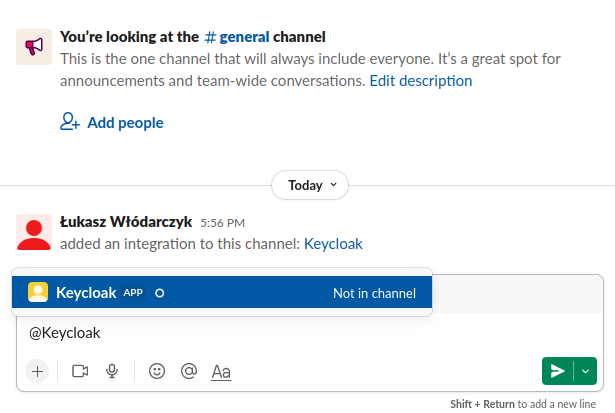
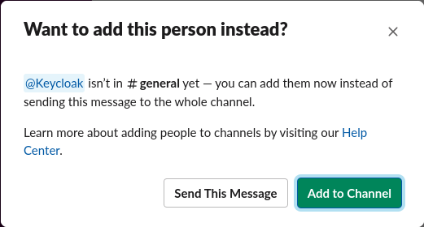

<h1 align="center">
    Keycloak event listener Slack
    <br>
    <a href="https://github.com/kilmajster/keycloak-event-listener-slack/actions">
        
    </a>
    
    
    
    <a href="https://keycloak-listener.slack.com/messages/C03V7AT6DHS">
        
    </a>
</h1>

### Project description
This project is an extension for Keycloak that allows to forward events to specified Slack channel. 
It's build for Keycloak X (quarkus), so it won't work with legacy Wildfly based Keycloak distributions.

### Set up with Keycloak
Minimal Dockerfile for bundling this extension together with Keycloak could look like following:
```dockerfile
FROM quay.io/keycloak/keycloak:18.0.2

ARG SLACK_LISTENER_VERSION=0.0.1

RUN curl -s -L -o /opt/keycloak/providers/keycloak-event-listener-slack--$SLACK_LISTENER_VERSION.jar \
    https://github.com/kilmajster/keycloak-event-listener-slack/releases/download/$SLACK_LISTENER_VERSION/keycloak-event-listener-slack-$SLACK_LISTENER_VERSION.jar

RUN /opt/keycloak/bin/kc.sh build

ENTRYPOINT ["/opt/keycloak/bin/kc.sh", "start"]
```

### Configuration

#### Creating and configuring Slack app
Go to https://api.slack.com/apps and click _Create New App_, choose option _From scratch_ and provide _App Name_ 
e.g. `Keycloak` then choose app installation workspace.

<p align="center">
    
</p>

After creating an app, go to its features and choose _Activate Incoming Webhooks_ and then click 
_Add New Webhook to Workspace_, choose which channel Keycloak should send messages to and click _Allow_.

When Incoming Webhooks are active, go to _OAuth & Permissions_ and in _Scopes_ add `chat:write` 
(you could need to reinstall app into workspace at this point)

<p align="center">
    
</p>

After that, copy `Bot User OAuth Token` (`xoxb-123123123...`) - you will need to add it as env variable for Keycloak.

Last step is to add app you just created to specific channel, 
to do that simply mention app by name at the desired channel, for e.g. `@Keycloak`, 
slack will ask if you want to add app to channel, click accept button.

<p align="center">
    
    
</p>

Done! From now Slack is ready to receiving messages from Keycloak.

#### Configuring events to forward

#### Configuring message format

### Enabling listener in Keycloak

### Development & testing


