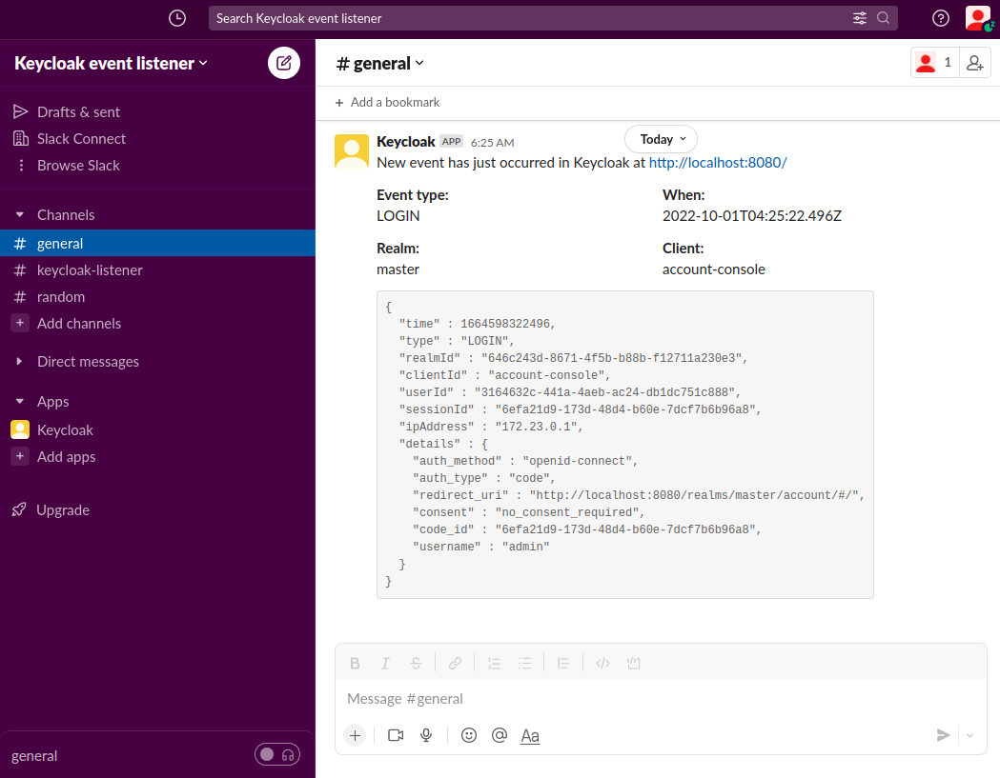
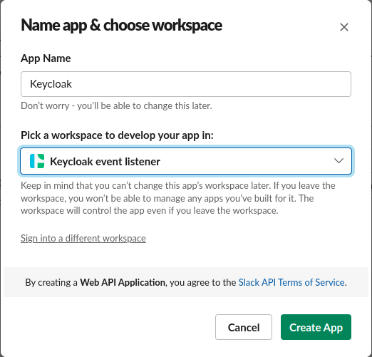
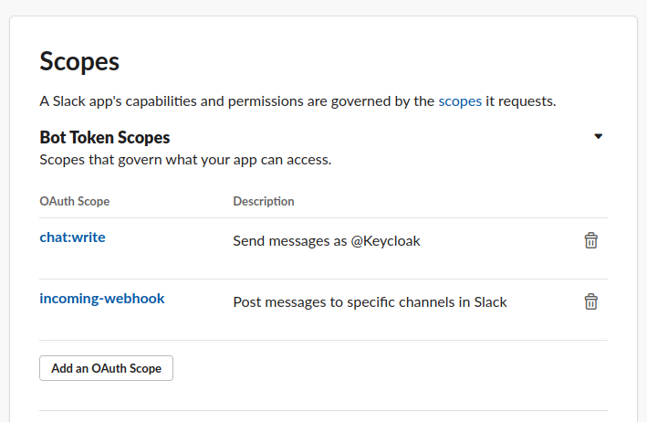
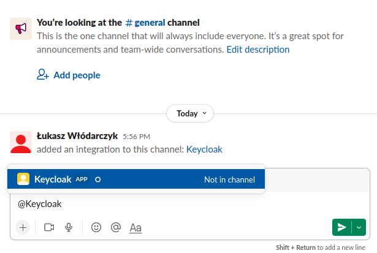
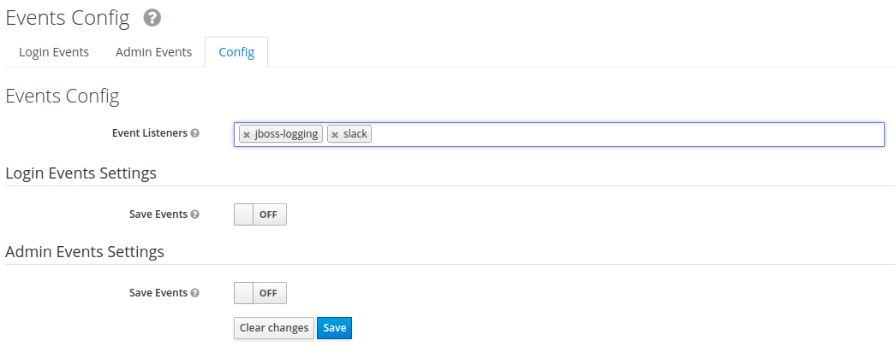

<h1 align="center">
    Keycloak Event Listener Slack
    <br>
    <a href="https://github.com/kilmajster/keycloak-event-listener-slack/actions">
        
    </a>
    <a href="https://github.com/kilmajster/keycloak-event-listener-slack/commits/main">
        
    </a>
    <a href="https://mvnrepository.com/artifact/io.github.kilmajster/keycloak-event-listener-slack">
        
    </a>
    <a href="./LICENSE">
        
    </a>
    <a href="https://keycloak-listener.slack.com/messages/C03V7AT6DHS">
        
    </a>
</h1>

### Project description
This project is an extension for Keycloak that allows to forward events to specified Slack channel. 
It's build for Keycloak X (quarkus), so it won't work with legacy Wildfly based Keycloak distributions.

<p align="center">
    
</p>

### Set up with Keycloak
Minimal Dockerfile for bundling this extension together with Keycloak could look like following:
```dockerfile
FROM quay.io/keycloak/keycloak:18.0.2

ARG SLACK_LISTENER_VERSION=0.1.0

RUN curl -s -L -o /opt/keycloak/providers/keycloak-event-listener-slack--$SLACK_LISTENER_VERSION.jar \
    https://github.com/kilmajster/keycloak-event-listener-slack/releases/download/$SLACK_LISTENER_VERSION/keycloak-event-listener-slack-$SLACK_LISTENER_VERSION.jar

RUN /opt/keycloak/bin/kc.sh build

ENTRYPOINT ["/opt/keycloak/bin/kc.sh", "start"]
```

### Configuration

#### Creating and configuring Slack app
Go to https://api.slack.com/apps and click _Create New App_, choose option _From scratch_ and provide _App Name_ 
e.g. `Keycloak` then choose app installation workspace.

<p align="center">
    
</p>

After creating an app, go to its features and choose _Activate Incoming Webhooks_ and then click 
_Add New Webhook to Workspace_, choose which channel Keycloak should send messages to and click _Allow_.

When Incoming Webhooks are active, go to _OAuth & Permissions_ and in _Scopes_ add `chat:write` 
(you could need to reinstall app into workspace at this point)

<p align="center">
    
</p>

After that, copy `Bot User OAuth Token` (`xoxb-123123123...`) - you will need to add it as env variable for Keycloak.

Last step is to add app you just created to specific channel, 
to do that simply mention app by name at the desired channel, for e.g. `@Keycloak`, 
Slack will ask if you want to add app to channel, click accept button.

<p align="center">
    
</p>

👏 Done! From now Slack is ready to receiving messages from Keycloak.

> In case of missing configuration `WARN` with error code will be logged. All error codes are described [here](https://api.slack.com/methods/chat.postMessage#errors).

#### Configuring Keycloak
Keycloak configuration is done based on environment variables. All their names and descriptions are listed below:
- `SLACK_TOKEN` - Slack _Bot User OAuth Token_. E.g. `"xoxb-123123123..."`


- `SLACK_CHANNEL`- channel used for forwarding events to. Can be channel name with # (`#general`) or channel ID (`C03V7AT6DHS`)


- `SLACK_INCLUDE_EVENTS` - comma-separated list of event types that should be forward to Slack. When present, 
other event related env variables are ignored. E.g. `"LOGIN, LOGIN_ERROR, LOGOUT, LOGOUT_ERROR"`


- `SLACK_INCLUDE_ALL_EVENTS` - for forwarding all possible events, good for testing purposes, not recommended for production.
Available values are `"true"` / `"false"`.


- `SLACK_INCLUDE_ALL_EVENTS_EXCEPT` - comma-separated list of event types exceptions, all other will be forwarded to Slack.
E.g. `"LOGIN, LOGIN_ERROR"`


- `SLACK_INCLUDE_ALL_ERRORS` - for forwarding all possible error events. Available values are `"true"` / `"false"`.


- `SLACK_INCLUDE_ALL_ERRORS_EXCEPT` - comma-separated list of error events exceptions, all other errors will be sent to Slack.
E.g. `"LOGIN_ERROR, LOGOUT_ERROR, UPDATE_PASSWORD_ERROR"`


- `SLACK_INCLUDE_ADMIN_EVENTS` - comma-separated list of admin operations (such as users creation, clients changes etc.).
Available values are `CREATE, UPDATE, DELETE, ACTION`


- `SLACK_INCLUDE_ALL_ADMIN_EVENTS` - for forwarding all events done by admin. Available values are `"true"` / `"false"`.

#### Configuring message format
By default, events json representation will be attached to the message. It can be disabled by:
- `SLACK_INCLUDE_EVENT_REPRESENTATION="false"` - for normal event types


- `SLACK_INCLUDE_ADMIN_EVENT_REPRESENTATION="false""` - for admin events

### Enabling listener in Keycloak
In the Keycloak admin console, choose realm and under _manage_ section go to _Events_. Switch to the _Config tab_ and add 
`slack` to the _Event Listeners_ then click _Save_ button.

<p align="center">
    
</p>

🕶 Done, Keycloak is ready to send messages with events to your Slack.

### Development & testing
To build a project, do following:
```sh
$ mvn clean install
```
You will need Slack workspace and app configured same as in _Configuration_ section, update `SLACK_TOKEN` and `SLACK_CHANNEL`
in `docker-compose.yml` file and run:
```sh
$ docker-compose up
```
Enable listener, just like it is described in _Enabling listener in Keycloak_ section.

#### Running automation tests locally
Build a project with `mvn clean install`, and run:
```sh
$  mvn verify -P automation-tests -D slack.token=<your Slack token> -D slack.channel=<your Slack channel>
```
